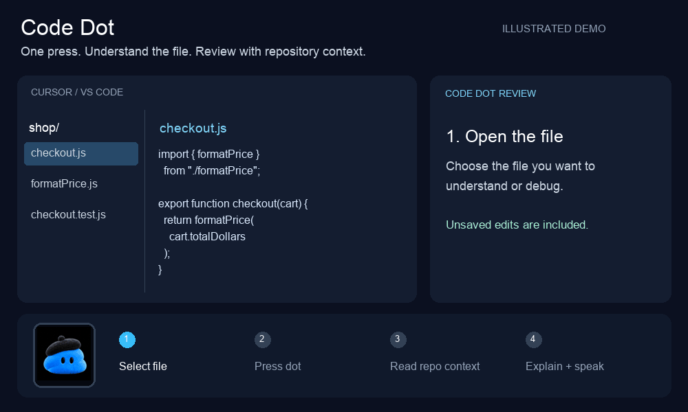

# Code Dot

A one-press code coach for Cursor and an Elgato Stream Deck. Select a file, press the animated dot, and get a spoken explanation of its logic and a review of potential bugs.

Code Dot is a local editor extension backed by the Codex CLI. It is not connected to the separate ChatGPT “Your dot” conversation.

## See how it works



*Illustrated walkthrough using sample code. The animation shows the review flow; actual review time varies. The GIF is silent—Code Dot speaks through your Mac.*

## What it does

- Captures the entire selected editor file, including unsaved edits.
- Finds its Git repository, including worktrees, or falls back to the open workspace folder.
- Lets Codex read relevant repository files to understand imports, callers, types, and tests.
- Explains the selected file’s purpose, logic, and connections to other files.
- Reports bugs, missing pieces, test suggestions, and alternative approaches.
- Displays the review beside the code and speaks a summary using the macOS voice.

Reviews use a read-only Codex sandbox. They do not automatically edit code or run project code. Other repository files are read from disk; only the selected file includes unsaved edits. Source snapshots and any repository context read by Codex are processed through the signed-in OpenAI account. Review speed and availability depend on the account and internet connection.

## Requirements

- macOS and Cursor (the extension API is also compatible with VS Code).
- Codex CLI bundled at `/Applications/ChatGPT.app/Contents/Resources/codex-cli/CodexCLI.app/Contents/MacOS/codex`.
- A working Codex sign-in: `codex login status`.
- Stream Deck software for the hardware button.

## Build and install

Run `python3 scripts/package.py` to build the VSIX. Install it using Cursor’s **Extensions: Install from VSIX** command, then reload the editor window.

## Configure the button

Add a Stream Deck **System → Website** action with this URL:

```text
cursor://snehal-local.code-dot/review
```

Set its title to **Code Dot** and use `icon.gif` for the animated icon. If Cursor asks permission to open the URI, choose **Open**. The prompt can be remembered for this extension.

Open the project folder in Cursor, open the file you want reviewed, and press the dot once. Without a repository or workspace, Code Dot reviews the selected file alone.

VS Code users can install the same VSIX and use `vscode://snehal-local.code-dot/review` instead.

## Commands

- **Code Dot: Review Current File and Speak**
- **Code Dot: Stop Review and Speech**

Speech can be disabled under **Code Dot → Speak** in editor settings. Errors are available in the **Code Dot** Output channel.

## Validation and limitations

The original file review and speech flow was confirmed on a physical Stream Deck. Version 0.2 adds repository context and a logic walkthrough; repository discovery checks passed, but the full updated hardware flow still needs verification. A terminal repository test encountered a nested macOS sandbox restriction. The extension rejects selected files over 250 KB and times out reviews after five minutes.

To regenerate the walkthrough, install Pillow and run `python3 scripts/make_demo.py`.
